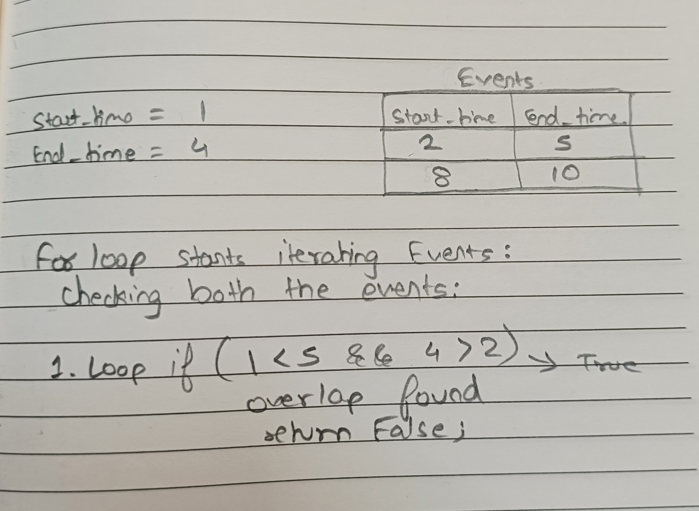

# Schedular Backend Application

1. To run the project, run the command `npm i` to install all the dependencies.

2. To run the server, run the command `npm start`.

3. Your server is up and will be running on port `3000`

## Logic in Schedular Class

1. To Add event

- Here we need to check if the event overlaps or not. For all the events we have `start_time` and `end_time` with us.

- Below is the image for the logic created in the for loop:

2. To Get events

- We just return the current list of events.
